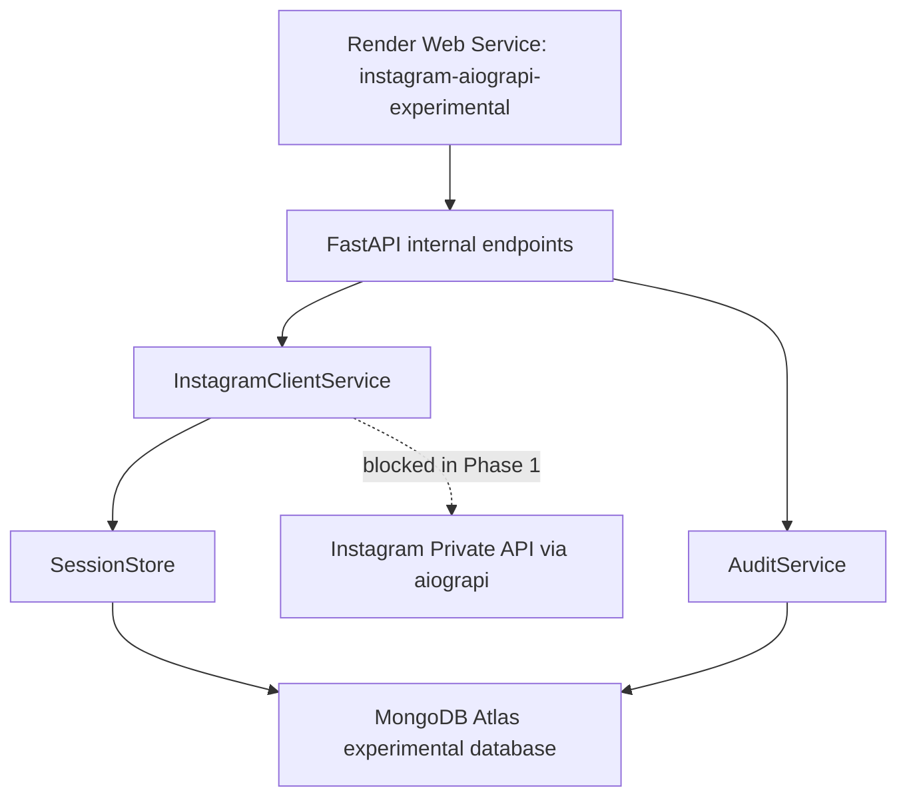

# Architecture

## Runtime

- Python 3.13.
- FastAPI/Uvicorn.
- `aiograpi==1.0.9`, pinado conforme a decisao da Fase 0.
- PyMongo async client.
- Fernet authenticated encryption via `cryptography`.

## Security Defaults

- Swagger/OpenAPI apenas em `APP_ENV=development`.
- Endpoints internos exigem token.
- Settings ficticias sao criptografadas antes de persistir.
- Real Instagram API permanece bloqueada.
- Polling permanece bloqueado.
